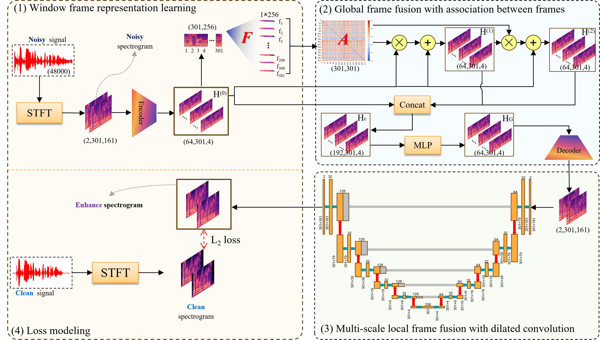

<h2 align="center"> <a href="https://www.ijcai.org/proceedings/2025/713">An association-based fusion method for speech enhancement</a></h2>

<div align="center">

**[_Shijie Wang_<sup>1</sup>](https://jie019.github.io/), _Qian Guo_<sup>2</sup>, _Lu Chen_<sup>1</sup>, _Liang Du_<sup>1</sup>, _Liang Du_<sup>1</sup>, _Zikun Jin_<sup>1</sup>, _Zhian Yuan_<sup>1</sup>, [_Xinyan Liang_<sup>1</sup>](https://xinyanliang.github.io/)**

<sup>1</sup>SXU <sup>2</sup>TYUST


<a href='https://www.ijcai.org/proceedings/2025/713'></a>&nbsp;

</div>


## Abstract
Deep learning-based speech enhancement (SE) methods predominantly draw upon two architectural frameworks: generative adversarial networks and diffusion models. In the realm of SE, capturing the local and global relations between signal frames is crucial for the success of these methods. These frameworks typically employ a UNet architecture as their foundational backbone, integrating Long Short-Term Memory (LSTM) networks or attention mechanisms within the UNet to effectively model both local and global signal relations. However, the coupled relation modeling way may not fully harness the potential of these relations. In this paper, we propose an innovative Association-based Fusion Speech Enhancement method (AFSE), a decoupled method. AFSE first constructs a graph that encapsulates the association between each time window of the speech signal, and then models the global relations between frames by fusing the features of these time windows in a manner akin to graph neural networks. Furthermore, AFSE leverages a UNet with dilated convolutions to model the local relations, enabling the network to maintain a high-resolution representation while benefiting from a wider receptive field. Experimental results demonstrate that the AFSE method significantly improves performance in speech enhancement tasks, validating the effectiveness and superiority of our approach.

## 🏗️Model
<div align="center">
  
</div>


## Data

We used two public datasets in this experiment:
- [VoiceBank-DEMAND](https://datashare.ed.ac.uk/items/6ed35425-bf14-4d2b-93a1-0a4984952757)
- [Interspeech 2020 DNS Challenge](https://github.com/microsoft/DNS-Challenge/tree/interspeech2020/master)

The dataset is organized as follows:
```bash
AFSE/
├── ...
└── datasets/
    └── VCTK/
        ├── train/
        │   ├── clean/
        │   └── noisy/
        └── test/
            ├── clean/
            └── noisy/
```

## Training
```bash
python estrain.py
```

## Inference
```bash
python test.py 
```

## 📑Citation
If you find this repository useful, please cite our paper:
```
@inproceedings{wang2025AFSE,
  title     = {An Association-based Fusion Method for Speech Enhancement},
  author    = {Wang, Shijie and Guo, Qian and Chen, Lu and Du, Liang and Jin, Zikun and Yuan, Zhian and Liang, Xinyan},
  booktitle = {Proceedings of the Thirty-Fourth International Joint Conference on
               Artificial Intelligence, {IJCAI-25}},
  pages     = {6406--6414},
  year      = {2025}
}
```
